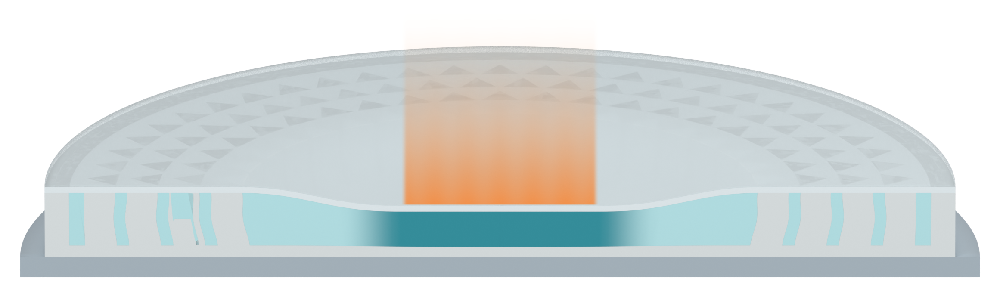

# Independent AM Figure 3 illustration

[Latest: frontal whole section and separate matching orange impact trail](panel_a_v30/MODEL_REVIEW.md)

The specimen section faces the observer. The orange square motion trail is separately delivered with a precisely registered transparent PNG pair. Closed SSG geometry and enclosed filling are checked. The lower two views are retained. These are qualitative native Blender illustration assets, not simulation results.
