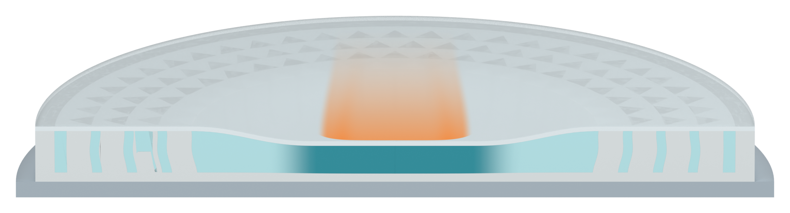

# Independent AM Figure 3 illustration

[Latest: shorter, gently streamlined orange impact trail](panel_a_v31/MODEL_REVIEW.md)

Four independent native Blender assets. The orange cue is shorter and has curved soft edges; the three specimen views and their SSG filling audit are retained. A registered transparent PNG pair supports direct overlay. Qualitative illustration only; no physical simulation.
