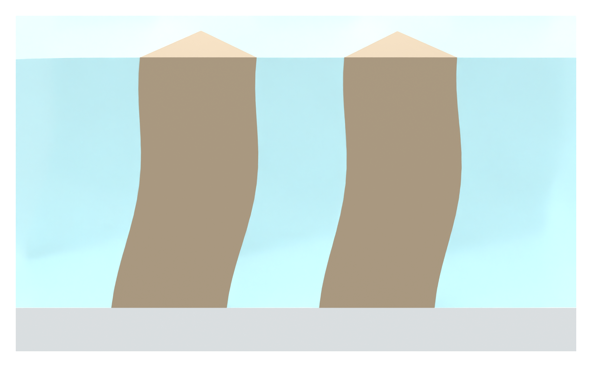

# Independent AM Figure 3 illustration

[Latest: shared section exposes the pillar faces](panel_a_v16/MODEL_REVIEW.md)

The common section cuts through both pillars and SSG so solid faces are directly exposed. The cloudy gel remains around and behind the pillars. Only browser-readable PNGs and Markdown are published.
