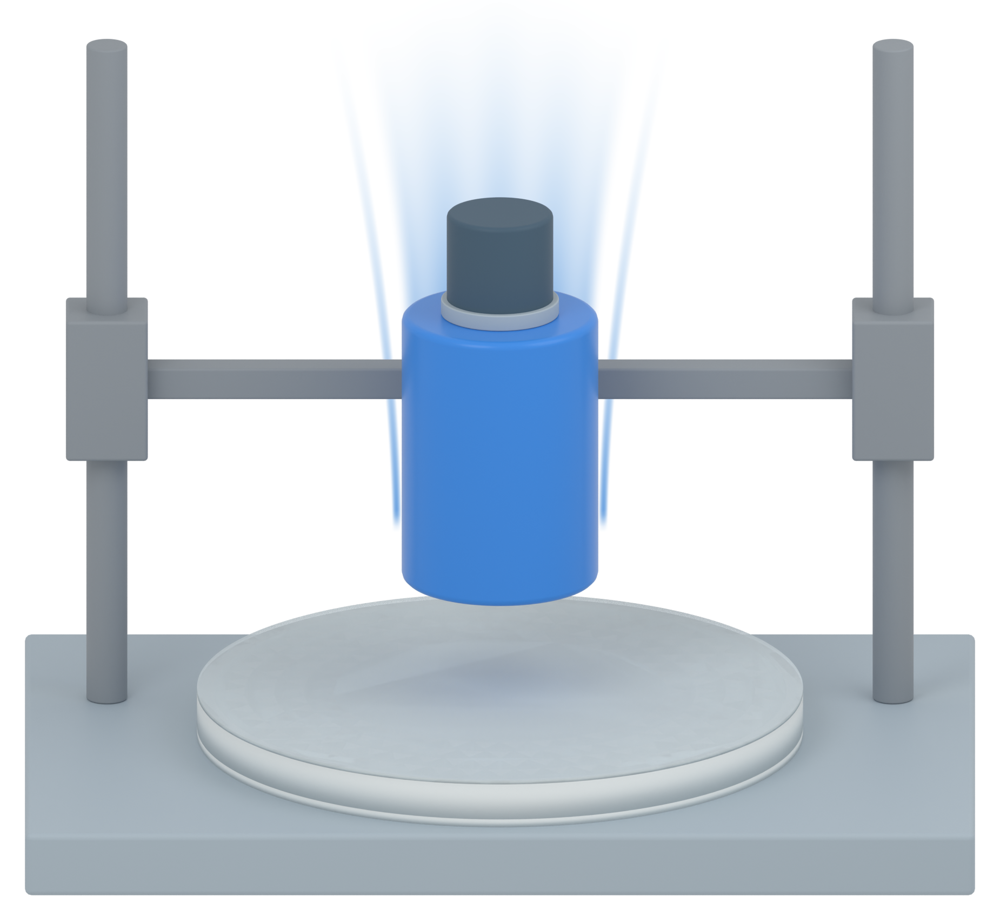

# Independent AM Figure 3 illustration

[Latest: blue comet-style downward-motion effect](panel_b_v05/MODEL_REVIEW.md)

Continuous blue flowing wake, sharp current impactor, retained panel-a device materials and a neutral-gray frame distinct from the deep blue-gray force sensor. Static illustration only; no physical simulation.

[Retained panel a](panel_a_v37/MODEL_REVIEW.md) · [Apparatus without motion cues](panel_b_v02/MODEL_REVIEW.md)
