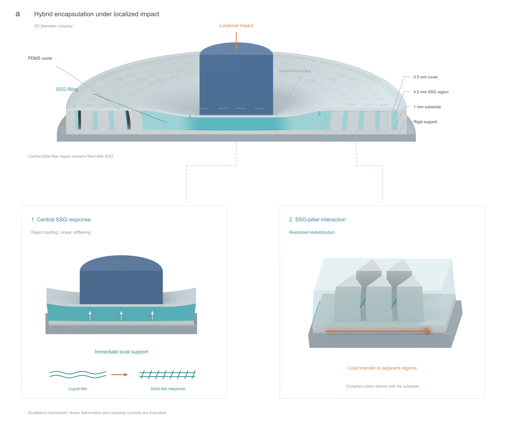

# Independent AM Figure 3 modeling

This is a separate manuscript illustration task, AM-FIG3-20261007-01.

## Latest discussion preview: native Blender Figure 3a

[Native model render and source audit](panel_a_v06/MODEL_REVIEW.md)

The illustration uses a circular diameter cutaway and two 3D detail views. Its mechanisms follow the original manuscript, while the deformation is qualitative. The editable native model was delivered directly to the human user. Only browser-viewable PNGs and Markdown are published here.

Previous previews are retained in [v04](v04/MODEL_REVIEW.md) and [panel a v05](panel_a_v05/MODEL_REVIEW.md).
