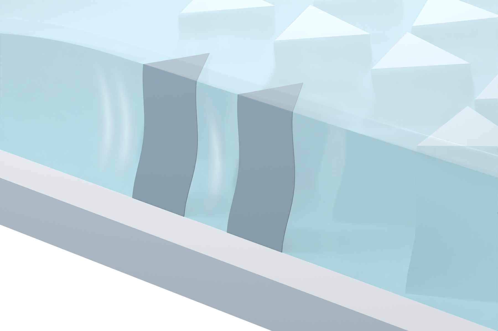

# Independent AM Figure 3 illustration

[Latest: cool palette and three-dimensional pillar close-up](panel_a_v20/MODEL_REVIEW.md)

Native Blender illustration with cool coordinated colors, milky SSG, gently bowed silicone pillars, shallow arc-wave cues, directional light and a complete translucent top cover. Source enclosure geometry is retained. The waves are qualitative illustration cues, not a computed flow field. Only browser-readable PNGs and Markdown are published.
