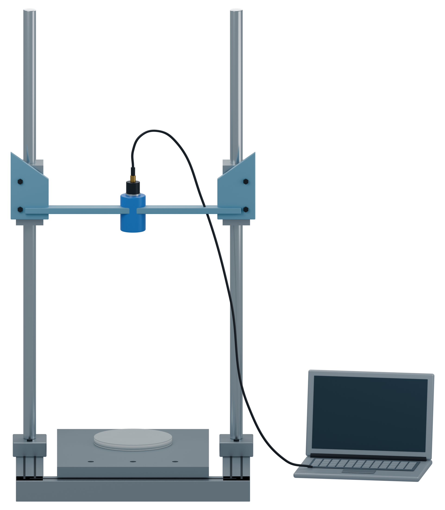

# Independent AM Figure 3 illustration

[Latest: first native model of the drop-weight apparatus](panel_b_v01/MODEL_REVIEW.md)

The original photograph guides the paired-post frame and suspended head. The manuscript governs the rear force sensor, 370 g mass parameter, 10/20/30 cm release settings and circuit-free 74 x 6 mm specimen. Native qualitative Blender illustration only; no physical simulation.

[Retained left-hand section without impact graphic](panel_a_v37/MODEL_REVIEW.md)
