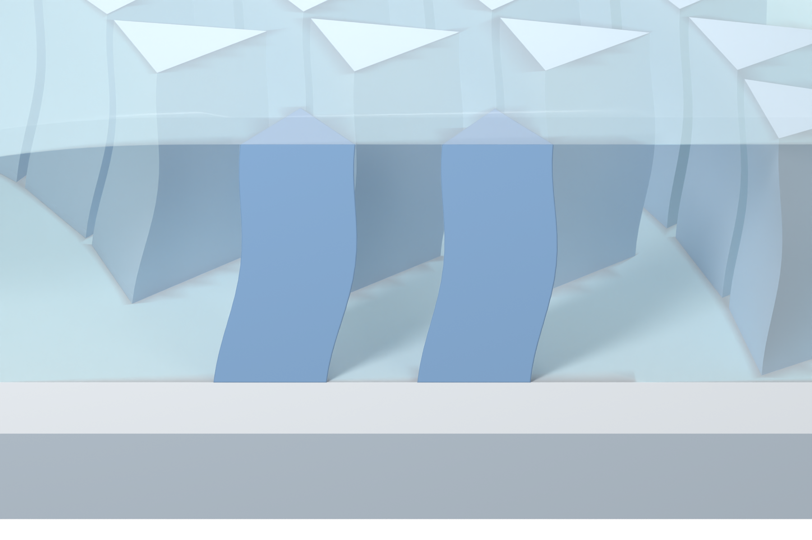

# Independent AM Figure 3 illustration

[Latest: original reference SSG material restored](panel_a_v25/MODEL_REVIEW.md)

The original V06 SSG material is reused directly, with no later glass-refraction or wave-normal effects. The frontal camera, blue pillars, filled enclosure and complete translucent top cover are retained. Only browser-readable PNGs and Markdown are published.
