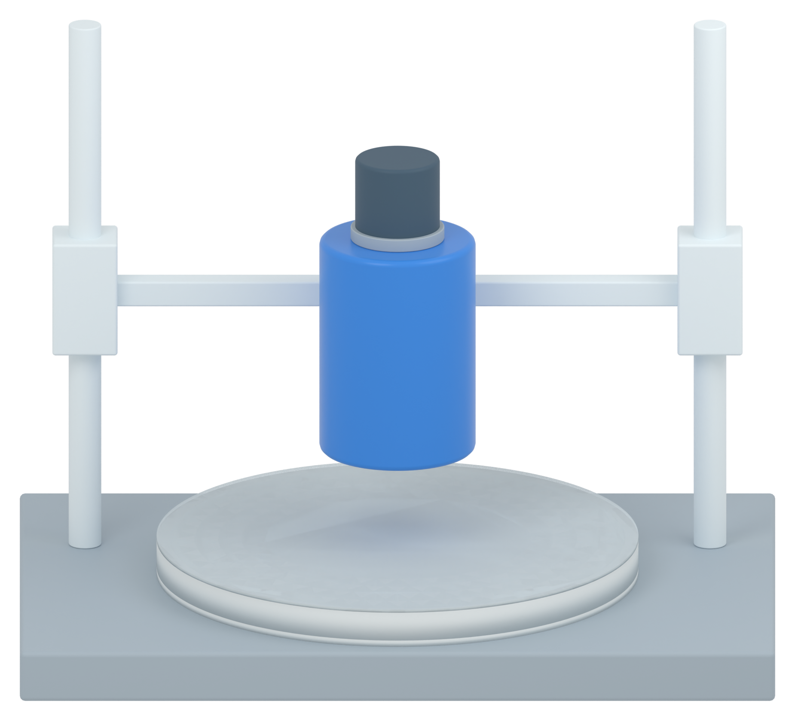

# Independent AM Figure 3 illustration

[Latest: simplified impact experiment matching panel a](panel_b_v02/MODEL_REVIEW.md)

The computer and realistic frame details are removed. Native shaders, white studio and frontal view match the accepted panel a. The head is drawn near the sample as a schematic impact experiment. No physical simulation.

[Retained panel a section without impact graphic](panel_a_v37/MODEL_REVIEW.md)
