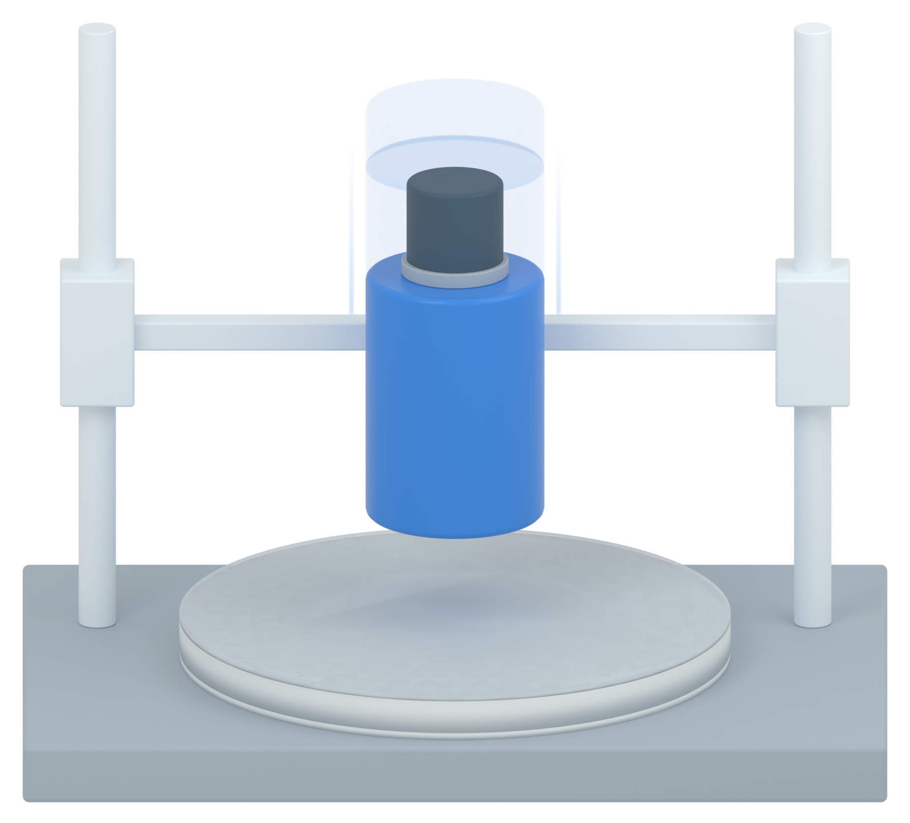

# Independent AM Figure 3 illustration

[Latest: simplified impact experiment with downward-motion cues](panel_b_v03/MODEL_REVIEW.md)

A sharp current impactor with progressively fainter earlier-position echoes above indicates downward movement. The native apparatus and panel-a material style are retained. Static illustration only; no physical simulation.

[Retained panel a section](panel_a_v37/MODEL_REVIEW.md) · [Apparatus without motion cues](panel_b_v02/MODEL_REVIEW.md)
