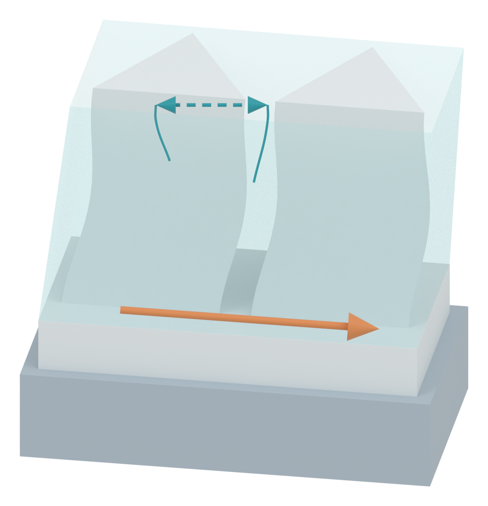

# Independent AM Figure 3 illustration

[Latest revision: gentle pillar bow and a straight confined fluid exterior](panel_a_v09/MODEL_REVIEW.md)

Only browser-viewable PNGs and Markdown are published. Transparent PNGs are linked in the review. Deformation and arrows are qualitative illustration cues.
