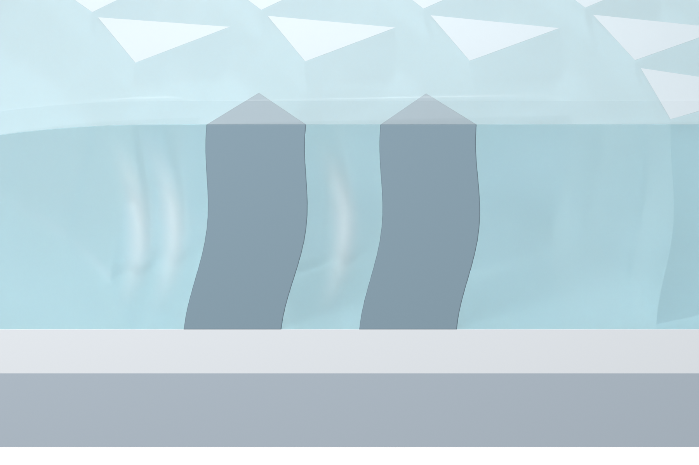

# Independent AM Figure 3 illustration

[Latest: frontal section with slight downward view](panel_a_v21/MODEL_REVIEW.md)

Native Blender illustration with a frontal camera, cool coordinated colors, milky SSG, gently bowed silicone pillars, shallow arc-wave cues and a complete translucent top cover. Geometry, materials and lighting are retained. No text or arrows appear in the close-up. Only browser-readable PNGs and Markdown are published.
