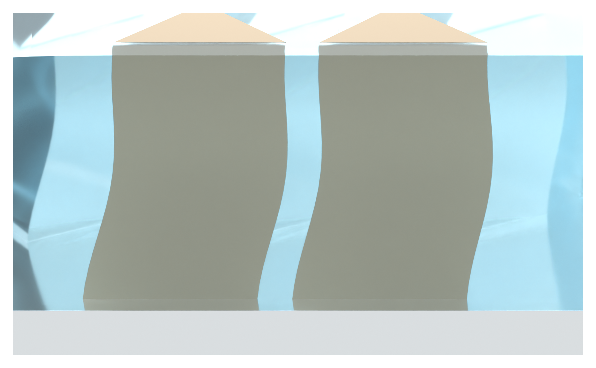

# Independent AM Figure 3 illustration

[Latest: continuous filled SSG close-up, no local arrows or leaders](panel_a_v14/MODEL_REVIEW.md)

The SSG volume surrounds the focus pillars continuously. Liquid, foreground pillars and background are visually differentiated. Only browser-readable PNGs and Markdown are published.
