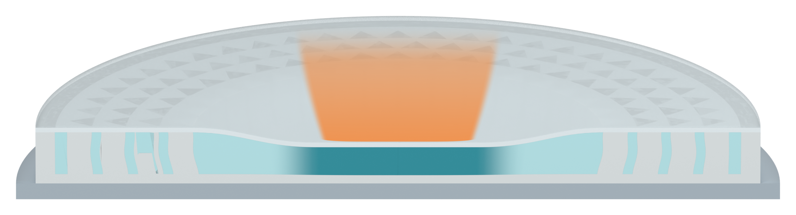

# Independent AM Figure 3 illustration

[Latest: inverted trapezoid orange impact trail](panel_a_v33/MODEL_REVIEW.md)

The human-directed orange trail is wider above and narrower at the indentation, with a continuous soft gradient. Its short height and registration are retained. Three specimen views and their original filling audit are unchanged. Native qualitative Blender illustration only; no physical simulation.
