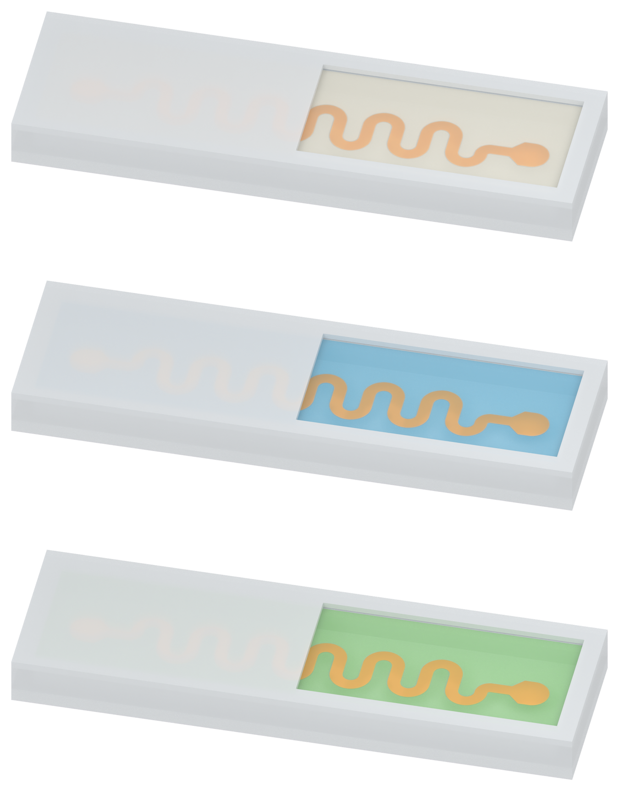

# Independent AM manuscript illustration

[Latest Figure 2 draft: bright copper and recessed silicone viewing window](figure2_v04/MODEL_REVIEW.md)

The opaque cap shares the outer-wall material. A real recessed transparent window, retained rim and visible cut faces expose the bright copper-yellow trace and distinguish milky PDMS, pale-blue SSG and pale-green silicone oil. Human visual review is pending; native model illustration only.

[Previous Figure 2](figure2_v03/MODEL_REVIEW.md) · [Figure 3a](panel_a_v37/MODEL_REVIEW.md) · [Impact apparatus](panel_b_v05/MODEL_REVIEW.md)
