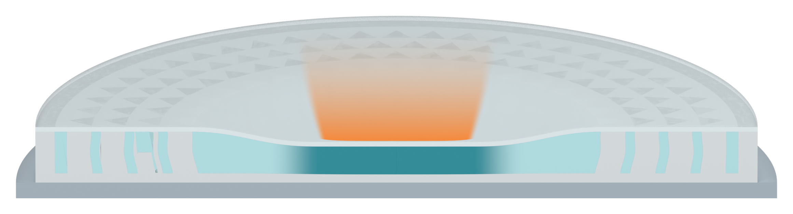

# Independent AM Figure 3 illustration

[Latest: full-length gradient on the inverted impact trail](panel_a_v34/MODEL_REVIEW.md)

The accepted inverted-trapezoid geometry is retained, with a stronger continuous fade from the lower contact to the upper tail. Official visual references are linked in the review. Three specimen views and their original filling audit are retained. Native qualitative Blender illustration only; no physical simulation.
