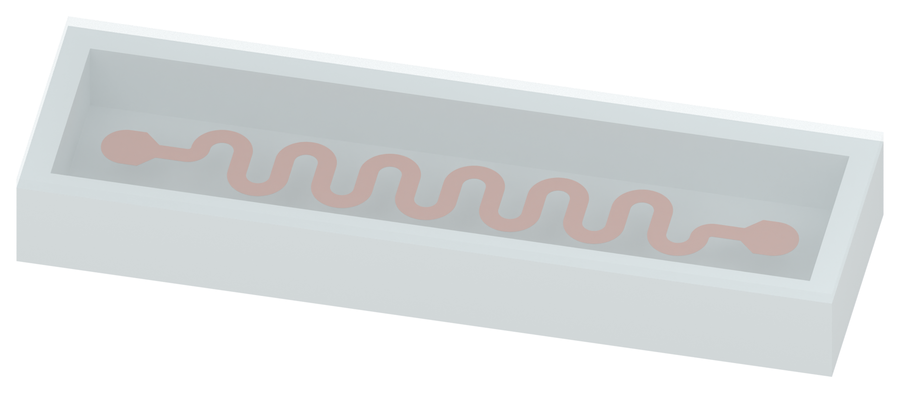
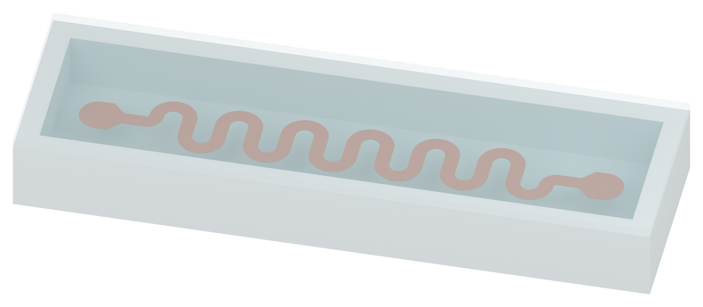
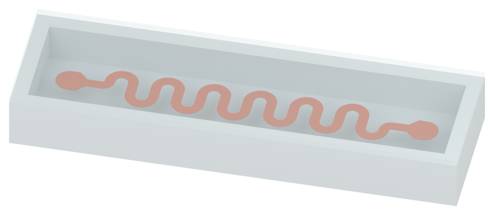

# Figure 2: three serpentine-interconnect filling model drafts

The human requested a silicone cavity containing one PI-Cu serpentine ribbon, separately filled with the same solid silicone, SSG and silicone oil. These are three undeformed native Blender model drafts for visual review, with identical geometry and camera. There is no physical simulation or deformation comparison.

## Solid PDMS

[Transparent PNG](01_solid_PDMS_v01_asset.png) · [Full 2100 x 1050 RGBA canvas](01_solid_PDMS_v01_full_canvas.png)

## SSG

[Transparent PNG](01_SSG_v01_asset.png) · [Full 2100 x 1050 RGBA canvas](01_SSG_v01_full_canvas.png)

## Silicone oil

[Transparent PNG](01_silicone_oil_v01_asset.png) · [Full 2100 x 1050 RGBA canvas](01_silicone_oil_v01_full_canvas.png)

## Geometry and material scope

The manuscript states a 0.30 mm line width, 1.125 mm amplitude, 1.35 mm period, 5 micrometre PI thickness and 500 nanometre copper thickness. Both actual layer thicknesses are modeled without display exaggeration. The current draft interprets amplitude as centerline peak-to-trough excursion. Six periods and terminal-pad shape are illustration choices; the manuscript does not provide a complete CAD drawing.

The illustrative rectangular cavity is 12.2 x 3.0 x 1.2 mm, with a 0.35 mm base, 0.45 mm perimeter wall and complete 0.20 mm lid. Those package dimensions are composition parameters rather than Figure 2 measurements. The 74 mm disk and 6 mm thickness from the separate impact study are not transferred to this tensile model. Flow-limiting pillars are omitted, consistent with the manuscript's Figure 2 stretchability study.

The solid filling uses the same source-a silicone shader family as the shell, with see-through inspection opacity. SSG uses the accepted source-a pale cyan material family; oil has a paler, smoother, more transparent display shader. The white studio and Standard/None transform follow panel a. Copper is shown with a warm copper illustration shader. Opacity, roughness and color are presentation choices, not measured optical properties. No free-surface air gap is introduced.

## Filled-volume and thin-layer display

Each construction volume is the entire closed cavity with the exact combined PI-Cu occupied volume subtracted by a native Boolean. Separate final Geometry Nodes modifiers omit only invisible contacting interfaces from the filling and the lid's bottom contact face. This avoids coincident transparent polygons obscuring the 500 nm copper layer or creating a diagonal shade seam at the lid contact. The modifiers do not alter the canonical filled-volume construction, ribbon shape, layer thickness, complete lid construction or main exposed filling surface. Toggle the final inspection modifier off to inspect each closed canonical mesh.

All 53 fresh native checks pass after reopening the saved model. These include real interior-stem width, period and excursion, unexaggerated PI/Cu layer thickness, closed shell and ribbon volumes, identical geometry across cases, complete cover and canonical fill-plus-ribbon volume closure. Each cavity has a volume of 43.92 cubic millimetres; its construction filling plus the actual PI-Cu occupancy matches this within 0.0002 cubic millimetres. All three individual native exports were reopened successfully.

No rendered text, arrows, force/stress plots, animation, Pro inquiry, local Git write or original DOCX/PPTX modification. Human visual acceptance remains pending. Only PNG and Markdown files are published, keeping native Blender models and receipts local.

[Retained Figure 3a](../panel_a_v37/MODEL_REVIEW.md) · [Retained impact apparatus](../panel_b_v05/MODEL_REVIEW.md)
