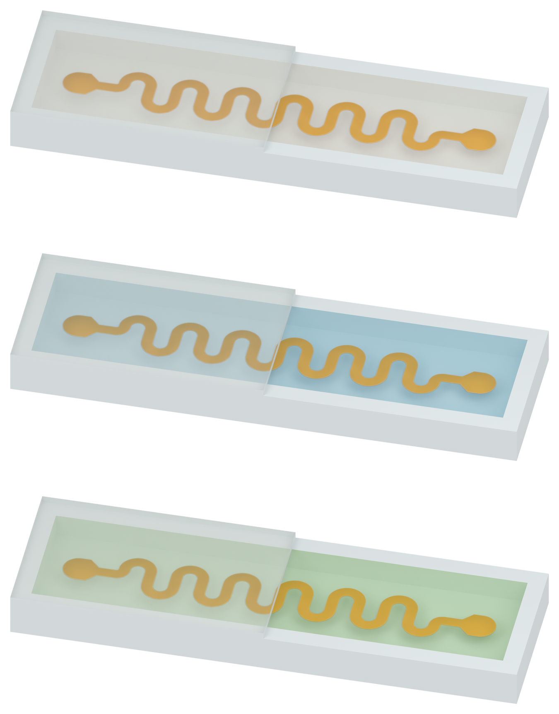

# Figure 2: copper-yellow serpentine, low walls and half-cover cutaway

The user requested copper-yellow traces in all three specimens, lower cavity walls, a retained silicone top layer with exactly one half cut away, and distinct filling colors: milky-white solid PDMS, pale-blue SSG and pale-green silicone oil. These are three undeformed Blender model illustrations for human visual review.

## Individual assets

| Filling | White preview | Transparent PNG |
| --- | --- | --- |
| Solid PDMS | [Preview](01_solid_PDMS_v02_preview_white.png) | [Asset](01_solid_PDMS_v02_asset.png) |
| SSG | [Preview](01_SSG_v02_preview_white.png) | [Asset](01_SSG_v02_asset.png) |
| Silicone oil | [Preview](01_silicone_oil_v02_preview_white.png) | [Asset](01_silicone_oil_v02_asset.png) |

## Geometry and display scope

The cavity is now 12.2 x 3.0 x 0.64 mm, with a 0.35 mm base, 0.45 mm wall width and 0.18 mm silicone cover. These package dimensions are illustration choices. The left longitudinal half of the lid remains, including visible solid cut edges; the right half is removed to expose the filling. Each cavity remains entirely filled except for the actual PI-Cu occupancy.

The manuscript's 0.30 mm ribbon width, 1.125 mm centerline excursion interpretation, 1.35 mm period, 5 micrometre PI and 500 nanometre Cu thicknesses remain unchanged. Six periods and terminal shapes remain illustrative. All three specimens share the same native geometry and camera. No pillar arrays are included in this Figure 2 model.

The accepted Figure 3 white studio and material family are retained, with the filling palettes adjusted as requested. Camera-aligned inspection transparency over the actual copper footprint keeps the buried metal legible; the soft mask is packed into the native Blender files. Display colors, opacity and roughness are illustration choices, not measured optical material properties. Moving the render camera requires regenerating the camera-aligned display mask.

All 53 fresh native geometry checks passed, including exact half-cover area, lowered wall height, unchanged real PI/Cu thicknesses, identical geometry across cases and filled-volume closure. All three standalone Blender files were reopened successfully. Original manuscript, previous native models and Figure 3 assets remain unchanged. There are no rendered words or arrows, physical simulations, Pro inquiries or local Git writes. Human visual acceptance remains pending.

[Previous Figure 2 draft](../figure2_v01/MODEL_REVIEW.md) · [Figure 3a](../panel_a_v37/MODEL_REVIEW.md) · [Figure 3b](../panel_b_v05/MODEL_REVIEW.md)
