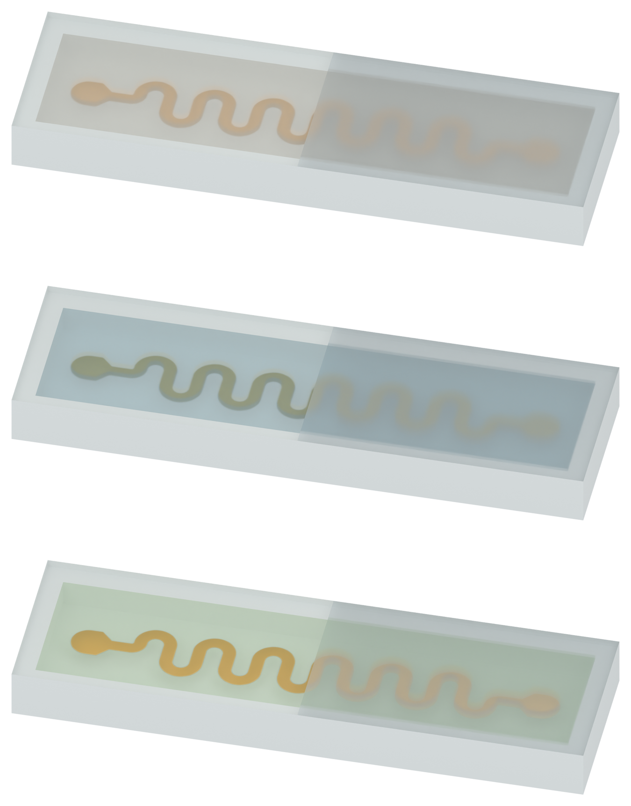

# Figure 2: full silicone cover and turbid encapsulation materials

The full silicone cover has been restored. Its left half retains the previous clear display material; its right half has the outer-frame milky palette and rough transmission, revealing the serpentine faintly. The user requested increased haze in PDMS and SSG, with PDMS more blurred than SSG. The green silicone-oil filling remains unchanged.

## Independent PNG assets

| Filling | White preview | Transparent PNG |
| --- | --- | --- |
| Solid PDMS | [Preview](01_solid_PDMS_v03_preview_white.png) | [Asset](01_solid_PDMS_v03_asset.png) |
| SSG | [Preview](01_SSG_v03_preview_white.png) | [Asset](01_SSG_v03_asset.png) |
| Silicone oil | [Preview](01_silicone_oil_v03_preview_white.png) | [Asset](01_silicone_oil_v03_asset.png) |

## Scope and verification

The low-wall cavity, copper-yellow conductor, camera, Figure 3 white studio and filling colors are retained. Only the cover geometry and requested optical display materials change. The entire cavity remains filled except for the actual PI-Cu occupancy. Source conductor widths, periods and actual 5 micrometre PI / 500 nanometre Cu thicknesses remain unchanged. The illustrative cavity is 12.2 x 3.0 x 0.64 mm, with a 0.35 mm base and 0.18 mm complete cover. Its clear and frosted top areas are exactly equal.

PDMS and SSG use increased milky mixing and rough transmission. The previous sharp copper-footprint transparency window is disabled in these two fillings. The clear cover half and unchanged silicone oil retain their prior inspection display materials. All optical settings are qualitative illustration choices, not measured material optics or a physical simulation.

All 56 fresh native geometry checks passed, including complete cover geometry, equal top-material areas, filled-volume closure, unchanged true PI-Cu thicknesses and identical geometry across cases. The three standalone Blender files were reopened successfully. Human visual acceptance remains pending. No rendered text or arrows, deformation, physical solver, Pro inquiry, source manuscript/PPT edit or local Git write.

[Previous draft](../figure2_v02/MODEL_REVIEW.md) · [Figure 3a](../panel_a_v37/MODEL_REVIEW.md) · [Figure 3b](../panel_b_v05/MODEL_REVIEW.md)
