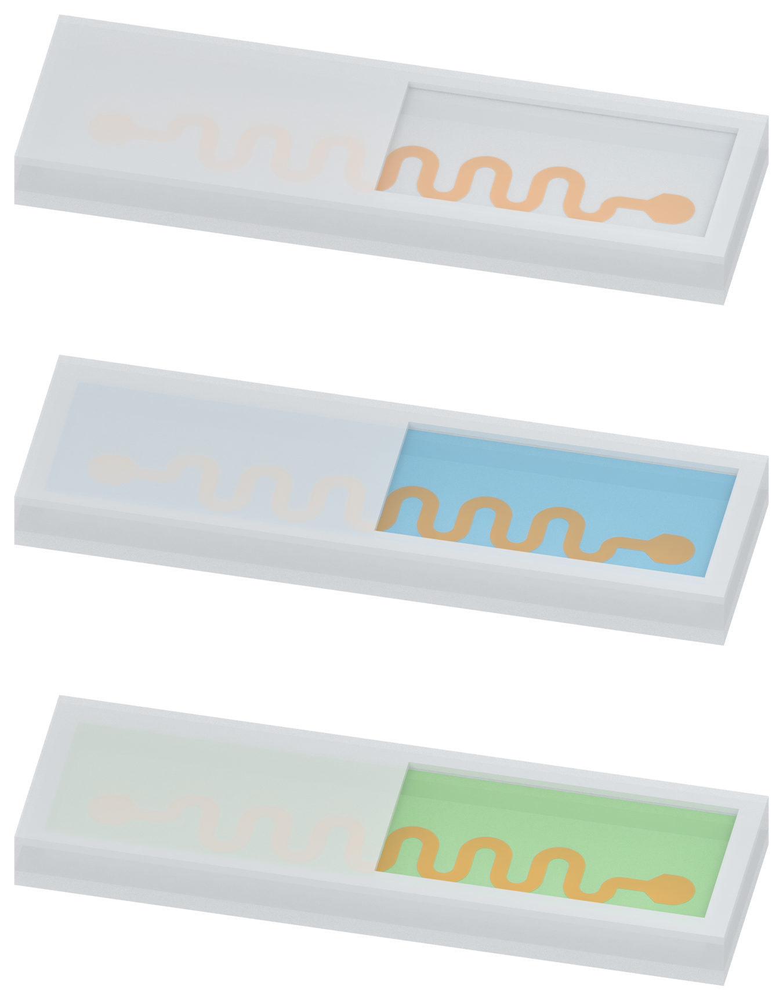

# Figure 2: floor-contact conductor and matching silicone palette

The last delivered v04 model suspended the PI-Cu ribbon at z=0.670 mm, 0.320 mm above the inner floor. This placement error is corrected: the PI support now contacts the inner silicone floor, copper lies directly on the PI, and the cavity remains filled above it.

The user also requested a PDMS filling color matching the wall silicone and a little more overall translucency. PDMS now uses the exact wall base RGB. The shared wall/opaque-cap display opacity changes from 0.88 to 0.78; PDMS filling opacity from 0.78 to 0.64. This reveals the bottom trace softly through the intact lid. PDMS remains more veiled than SSG and oil. The copper color, blue SSG, green oil, recessed inspection window, camera and studio are retained.

## Separate assets

| Filling | White preview | Transparent PNG |
| --- | --- | --- |
| Wall-matched milky PDMS | [Preview](01_solid_PDMS_v06_preview_white.png) | [Asset](01_solid_PDMS_v06_asset.png) |
| Pale-blue SSG | [Preview](01_SSG_v06_preview_white.png) | [Asset](01_SSG_v06_asset.png) |
| Pale-green silicone oil | [Preview](01_silicone_oil_v06_preview_white.png) | [Asset](01_silicone_oil_v06_asset.png) |

## Layer placement and saved-model verification

From bottom to top: silicone base -> 5 micrometre PI support -> 500 nanometre copper -> filling -> silicone cap. Floor/PI bottom z=0.350 mm; PI top/Cu bottom z=0.355 mm; Cu top z=0.3555 mm; fill top z=0.990 mm. The copper is covered by 0.6345 mm of filling. The cavity dimensions remain illustrative at 12.2 x 3.0 x 0.64 mm; conductor width, shape and real thicknesses are unchanged.

The opaque cap and wall share one actual Blender material. The right viewing membrane and recessed cut step retain their geometry. Camera-aligned opacity is aligned to the lower copper to aid inspection of the buried trace. Colors, opacity and the viewing recess are illustration treatments, not measured optical or fabrication properties.

All 71 fresh saved-model checks passed, including floor contact, copper/PI contact, fill above copper, complete filling-volume closure, matching silicone RGB, increased translucency and identical geometry across all three materials. Each standalone native model was reopened and checked again for floor contact. Human visual acceptance remains pending. No physical simulation, rendered text or arrows, Pro inquiry, source-document edit or local Git write.

[Last published v04 draft](../figure2_v04/MODEL_REVIEW.md) · [Retained Figure 3a](../panel_a_v37/MODEL_REVIEW.md) · [Retained Figure 3b](../panel_b_v05/MODEL_REVIEW.md)
