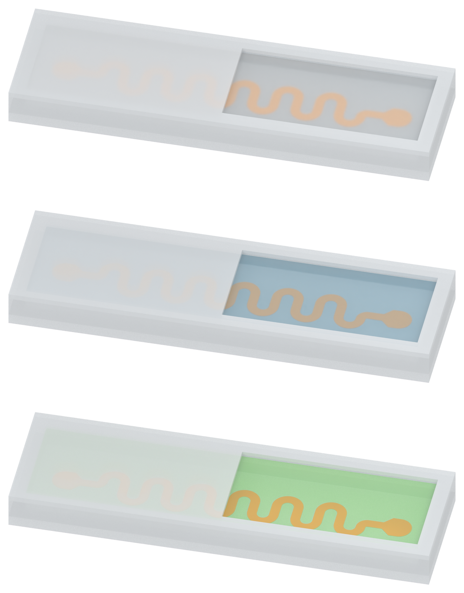

# Figure 2: native filling haze over the buried floor conductor

The user reported that the sharp copper trace still appeared to lie on top of the filling. Geometry remained correct: the PI support is on the inner silicone floor, Cu is on PI, and 0.6345 mm of filling covers Cu. The visual problem was the copper-footprint-specific clear material path.

PDMS and SSG now use uniform native rough transmission across the filling. Their sharp copper-footprint transparency windows are disabled. SSG softly blurs the buried conductor; PDMS has stronger haze and blur. The clear silicone-oil shader is unchanged. The wall-matched milky PDMS, blue SSG, green oil, bright copper shader, silicone lid, recessed viewing window, camera and lights are retained.

## Separate assets

| Filling | White preview | Transparent PNG |
| --- | --- | --- |
| Milky PDMS - stronger haze | [Preview](01_solid_PDMS_v07_preview_white.png) | [Asset](01_solid_PDMS_v07_asset.png) |
| Blue SSG - softer blur | [Preview](01_SSG_v07_preview_white.png) | [Asset](01_SSG_v07_asset.png) |
| Green silicone oil - clear | [Preview](01_silicone_oil_v07_preview_white.png) | [Asset](01_silicone_oil_v07_asset.png) |

## Layer placement and material verification

Bottom to top: silicone base -> 5 micrometre PI -> 500 nanometre Cu -> filling -> silicone cap. Inner floor/PI bottom z=0.350 mm; PI top/Cu bottom z=0.355 mm; Cu top z=0.3555 mm; filling top z=0.990 mm. The complete filling covers the copper by 0.6345 mm.

PDMS and SSG replace the clear transmitted branch with a native rough-refraction branch and a uniform diffuse mix. PDMS has roughness 0.42/diffuse fraction 0.34; SSG 0.24/0.25. These parameters, opacity, color and the inspection recess are qualitative illustration choices, not measured optical properties. The blur is part of the editable native Blender shader, without image-space blurring of the copper or entire figure.

All 73 fresh saved-model checks passed. They verify floor contact, actual layer thicknesses, complete filling-volume closure, identical geometry across the three materials, unchanged v06 geometry, uniform PDMS/SSG haze without the sharp footprint path, stronger PDMS haze, the exactly unchanged oil shader and unchanged source artifacts. The three standalone exports were reopened and checked for floor contact. Human visual acceptance is pending. No rendered labels/arrows, physical simulation, Pro inquiry, source document modification or local Git writes.

[Previous draft](../figure2_v06/MODEL_REVIEW.md) · [Retained Figure 3a](../panel_a_v37/MODEL_REVIEW.md) · [Retained Figure 3b](../panel_b_v05/MODEL_REVIEW.md)
