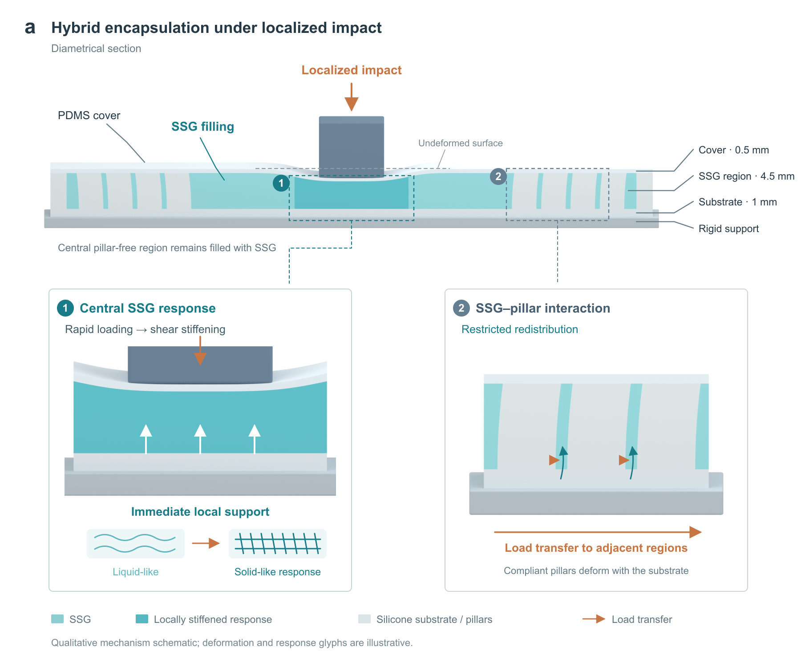

# Figure 3a: loaded hybrid section and two mechanism details

This is a first discussion preview requested by the human user, following the latest panel-a discussion in **撰写AM论文部分**. It replaces the earlier apparatus-only panel-a concept with a long loaded hybrid section and two square detail views. It is not an accepted final manuscript figure.

## Source-grounded content

The supplied manuscript is the factual authority. Codex checked its original text directly; Pro supplied the drawing decision.

- Section 2.1: monolithic silicone substrate and soft flow-limiting pillars, SSG filling, and a thin PDMS cover; pillars suppress expansion and fluidic behavior, helping retain central SSG thickness.
- Section 2.3: impact specimens contain no electronics, have diameter 74 mm and total thickness 6 mm, with nominal cover / intermediate / base thicknesses of 0.5 / 4.5 / 1 mm.
- Section 2.3 mechanism paragraph: rapidly deformed central SSG provides immediate local support through shear stiffening; surrounding SSG redistributes and interacts with discrete pillars, transferring load to adjacent regions of the monolith. The pillars and bulk silicone also deform.
- Methods, Fabrication of the Encapsulation Structures: **triangular flow-limiting pillars, side length 3 mm and inter-pillar gap 0.6 mm**. This corrects the earlier v04 note that the triangular profile was only a visual inference. Exact radial arrangement and a manufacturing CAD were not provided.

## Visual choices

The upper section shows a continuous cover depressed under an impactor, a filled central pillar-free region, and peripheral soft pillars integrated with the base. The two detail boxes explain central support and surrounding SSG–pillar interaction. The dashed line indicates the undeformed surface.

Darker cyan and the response glyphs express local stiffening qualitatively. The liquid-like → solid-like glyph is a constitutive response symbol; it is not a molecular image, a crystallization claim, or evidence of a thermodynamic phase transition. SSG redistribution arrows stay in filling channels. Orange arrows indicate load transfer.

The nominal material layer dimensions and the methods' pillar side/gap were used as references. The drawn indentation of 1.15 mm, pillar-tip deflection of 0.28 mm, pillar count, and displayed radial positions are **illustrative geometry choices**, not measured or computed deformations. This is not an FEA field, a force curve, or a quantitative microscopic model. No physics simulation was run.

## Scope and verification

- Only panel a was produced for the user's discussion. Figure 3 as a whole was not laid out.
- Original DOCX/PPTX and v04 artifacts were preserved.
- Blender 5.1 generated the three section renders; editable Blender and SVG sources were retained locally.
- The composed PNG was inspected for layer continuity, visible indentation, readable labels, source-region connections, and arrows confined to the intended regions.
- No new message was sent to Pro. The existing inquiry count remains 1/10.
- Only these PNGs and this browser-readable note were selected for GitHub; no original manuscript, PPTX, Blender file, or private Pro transcript was uploaded.

Source DOCX SHA256: `333739523d31456a5af716dcae5dbbddb1ffb54254c982b6a6f4757500260da4`.

Reference figure deck SHA256: `6de1a257b1ac2161eeb215a3e5794ea56fc4df772d8aecdd124f59b95a3f1b83`.
