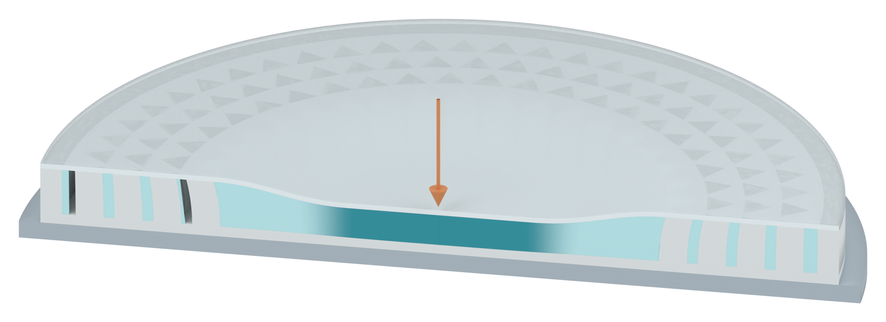
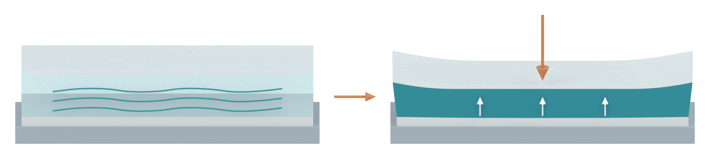
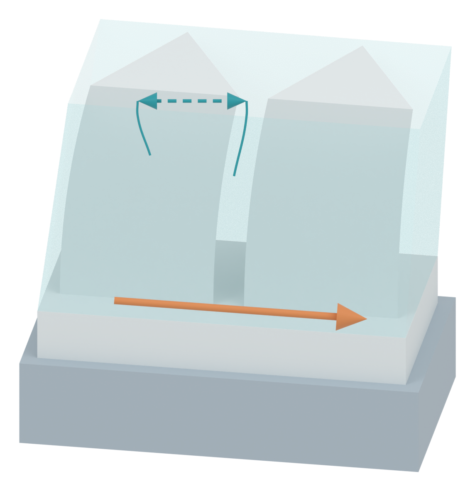

# Three independent text-free native Blender assets

AM-FIG3-20261007-01 is an independent manuscript illustration task.

## Impacted circular section

[Transparent PNG](01_impact_section_v07_asset.png)

The impactor has been replaced by a single downward impact cue. The disc has a continuous depressed cover, a central SSG-filled region and peripheral triangular pillars.

## SSG mechanical response contrast

[Transparent PNG](02_SSG_response_contrast_v07_asset.png)

The pale nominal state and the darker compressed state distinguish liquid-like and solid-like rate-dependent mechanical response. This is qualitative shear stiffening, not a thermodynamic phase transition, crystallization or a molecular model. The wave strokes and support arrows are schematic response cues.

## Local SSG and pillar interaction

[Transparent PNG](03_pillar_interaction_v07_asset.png)

A local display crop isolates two existing adjacent triangular pillars and their continuous substrate. The complete disc array has not changed. The double-headed dashed symbol denotes qualitative SSG–pillar interaction, while the single-headed orange arrow indicates outward load transfer to adjacent regions. Neither represents a computed force vector or fluid trajectory. The two old around-pillar flow arrows have been removed. Image lettering, numbering and frames are omitted at the human user's request.

## Source boundaries and verification

The original manuscript is the factual authority: §2.1 describes confinement and monolithic pillars/base; §2.3 describes stiffening, redistribution, pillar interaction and transfer to adjacent regions. Methods specify triangular pillars with 3 mm sides and 0.6 mm gaps. The nominal device diameter is 74 mm, with 0.5 / 4.5 / 1 mm layers. FigureSet slides 1 and 3 inform appearance only.

Thirty-four checks passed after reopening the saved native Blender file: three clean scenes; no text objects, impactor or bitmap planes; unchanged full-disc mesh and shape-key coordinates relative to v06; two local 3 mm triangular pillars with the retained 0.6 mm front gap; nominal low-rate reference; coupled cover/pillar deformation and cover thickness at control values 0, 0.5 and 1.

The exact radial layout and deformation amplitudes remain illustration choices. No FEA, experiments, stress map, solved load trajectory or quantitative force/energy claim is included. These checks verify the native model and illustration, not physical accuracy. The original DOCX/PPTX hashes are unchanged. The editable Blender file is delivered locally to the human and is not uploaded. Only PNGs and Markdown are published.

The pillar update used one preview and one final render. Pro inquiry usage remains 2/10; the ruling was a semantic drawing decision, not visual acceptance of these images. No further inquiry is automatically sent.
