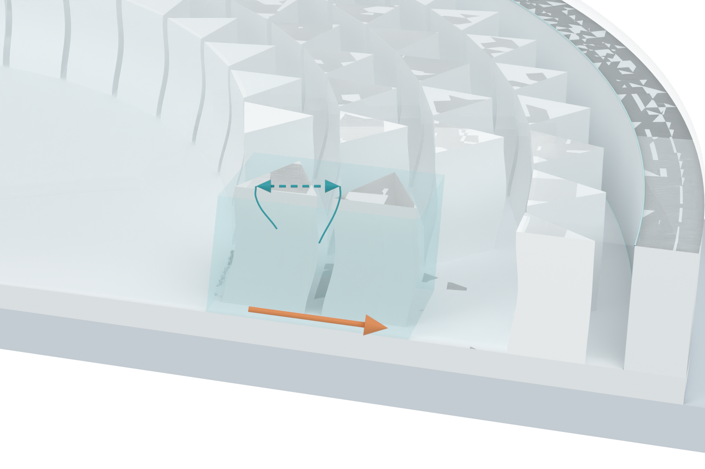

# Contextual pillar close-up with a transparent observation window

The local mechanism view now retains the surrounding circular device, its continuous base, cover and neighboring pillar arrays. It uses a perspective camera. The two foreground pillars and their SSG remain the visual focus.

[Transparent close-up PNG](03_pillar_context_v10_asset.png)

The cover and surrounding pillars that obstruct the foreground window are made fully transparent for display. Whole background pillar components in this window are cleared through material transparency. The surrounding array remains visible outside the window, with pale materials. The full continuous base replaces the former standalone local pedestal. Matrix boundary curves preserve the enclosure context without overlaying another gel volume on the focus pair.

This is a qualitative mechanism close-up. The foreground pair remains an idealized geometry demonstration with nominal 3 mm triangular sides and a 0.6 mm front gap, placed in the existing device context. It is not an exact extraction of a supplied fabrication CAD file. Display transparency and quiet background shadows are illustration choices, not measured optical properties or a physical modification to the specimen.

The gentle midpoint bow stays at the existing illustrative 0.25 mm setting. The fluid exterior retains its constrained boundary. The interaction symbol and outward load-transfer arrow remain qualitative annotations. There are no rendered letters, numbers, panel frames or impactors.

20 checks passed after reopening the native Blender file: primary and foreground geometry/material assignments are unchanged from v09; the continuous body, cover and array are present; the observation window is transparent; the foreground pillars remain attached to the continuous base and in contact with the local filling; and the view has the same two annotation kinds without text or bitmap planes.

## Other assets retained

[Transparent main section](01_impact_section_v10_asset.png)

[Transparent SSG comparison](02_SSG_response_contrast_v10_asset.png)

These two raw renders are byte-identical to v09. No full Figure 3 composition or Figure 3b work is included. No physics simulation, new Pro inquiry or local Git write was performed. The original DOCX/PPTX hashes are unchanged. Only PNGs and Markdown are published; the editable Blender file and PNG archive remain local deliveries.
