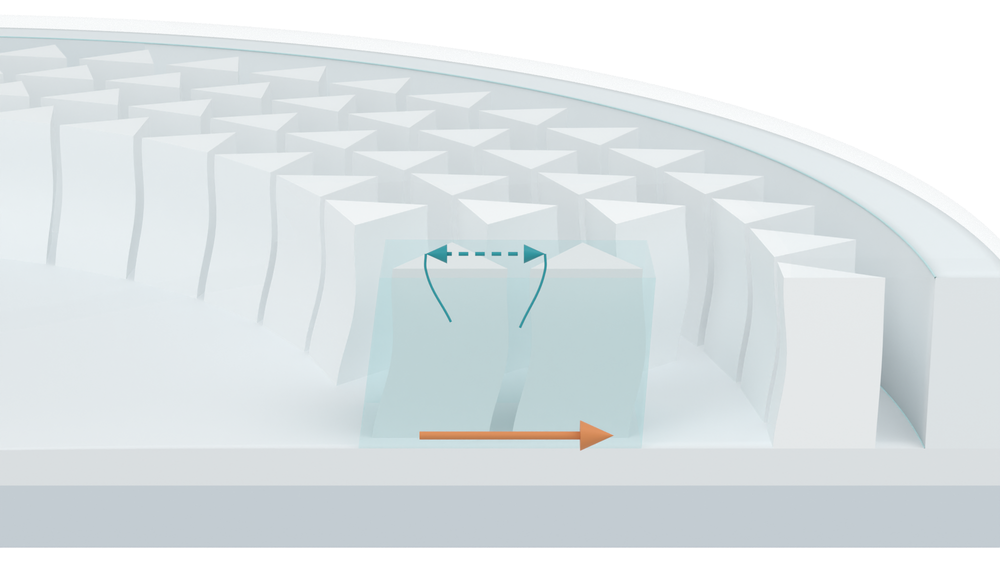

# Front-facing section with device context

The human requested the cut section to face the viewer. The local perspective camera now has zero yaw and roll, with a slight elevation of approximately 17 degrees to retain visible triangular pillar tops and device depth. The section baseline is horizontal.

[Transparent close-up PNG](03_pillar_context_v12_asset.png)

This revision changes the local camera and reconstructs its native annotation leaders for the new projection. The continuous circular base, rim, cover, neighboring arrays and foreground SSG/pillars retain their v11 geometry and material assignments. The fully transparent observation window and its native display masks are retained. The display masks exclude ghost faces and the coincident lower context-cover skin from rendering while preserving source geometry.

The pillar midpoint bow remains at the existing illustrative 0.25 mm setting. The constrained fluid exterior is unchanged. The foreground pair is an idealized mechanism illustration with nominal 3 mm triangular sides and a 0.6 mm front gap, rather than exact fabrication CAD. The dashed double-headed relationship with arrowless leaders represents qualitative SSG-pillar interaction. The orange arrow represents outward load transfer. These are not computed force vectors or fluid trajectories. There is no rendered lettering or impactor.

26 native checks passed after reopening: the section camera faces the reader without yaw or roll; primary and foreground geometry/materials match v09; surrounding context geometry/materials match v11; the observation masks remain in place; the foreground pillars attach to the continuous base and contact the filling. These are illustration checks, not physics validation.

## Other two assets retained

[Transparent impact section](01_impact_section_v12_asset.png)

[Transparent SSG response contrast](02_SSG_response_contrast_v12_asset.png)

The other two raw renders are byte-identical to v11 and v09. The SSG contrast represents liquid-like to solid-like mechanical response through shear stiffening. No full Figure 3 layout, Figure 3b, physics simulation, new Pro inquiry or local Git write was performed. Original DOCX/PPTX hashes remain unchanged. Only PNGs and Markdown are published; the editable Blender file and PNG archive are delivered locally.

[Previous contextual view](../panel_a_v11/MODEL_REVIEW.md)
