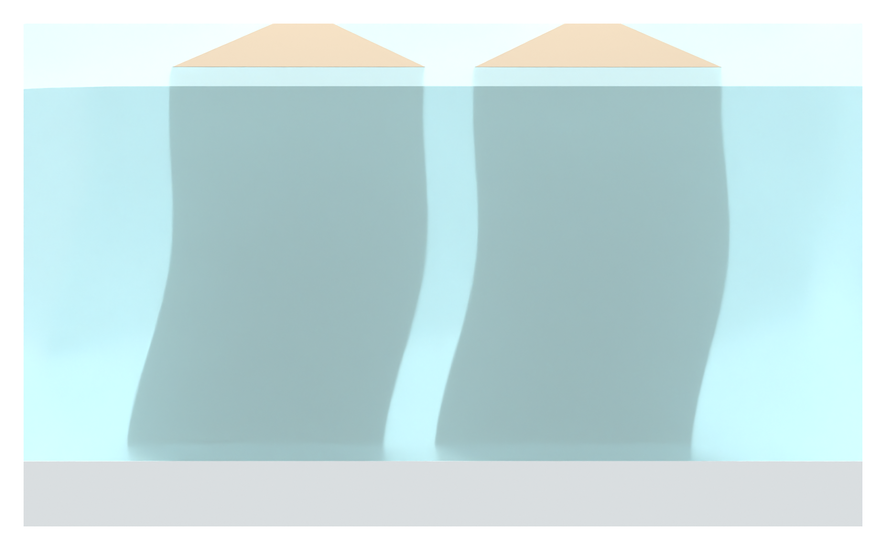

# Turbid translucent SSG gel: material-only revision

The human judged the v14 SSG to be too transparent. This revision lowers transmission and adds a cloudy, milky gel appearance while retaining the filled native geometry and no-arrow local framing.

[PNG close-up asset](03_pillar_context_v15_asset.png)

The SSG transmission is reduced from 0.96 to 0.52, surface roughness is increased from 0.105 to 0.255, and volume scattering is added. The gel has a muted blue-cyan tint, broader highlights and softer visibility of the warm-gray pillars. Deep neighboring structures are less visible through it. These numbers are renderer settings chosen for illustration, not measured optical properties of the supplied SSG formulation.

All native mesh geometry and material assignments match v14. The continuous filling, robust native pillar cavities, filled-to-cover level, gentle 0.25 mm pillar bow, front-facing crop and absence of local arrows/heads/leaders are preserved. No liquid level, physics result or device construction has been changed.

27 checks passed after reopening: all native mesh geometry/material assignments match v14; all 30 frontal filling sample points remain in SSG; both pillar interiors remain excluded; the cloudy SSG shader is enabled; and no local arrows or labels are present. These checks qualify the illustration only.

## Other two assets retained

[Impact section PNG](01_impact_section_v15_asset.png)

[SSG response contrast PNG](02_SSG_response_contrast_v15_asset.png)

These two raw renders are byte-identical to v14. Original DOCX/PPTX hashes are unchanged. No physics simulation, Pro inquiry, overall Figure 3 layout or local Git write was performed. Only browser-readable PNGs and Markdown are published; the editable Blender model and PNG archive are local deliveries.

[Previous clear rendering](../panel_a_v14/MODEL_REVIEW.md)
