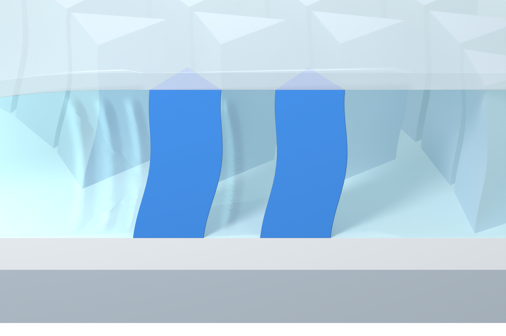
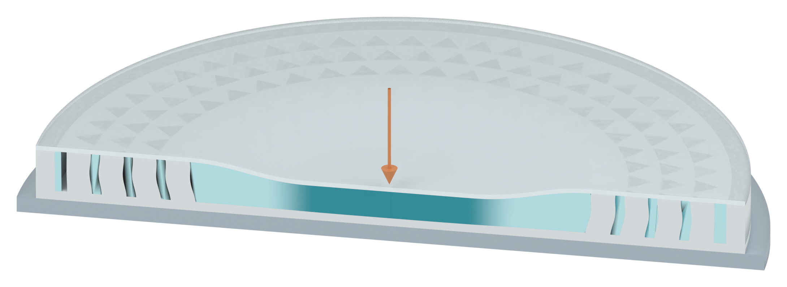

# Less transparent top cover and clearer native shallow waves

The human approves the V26 palette and curved wave form. This revision makes the silicone top cover more apparent and increases the visibility of those same shallow waves.

[Transparent PNG close-up](03_pillar_context_v27_asset.png)

The complete nominal 0.5 mm PDMS/silicone cover retains its geometry and pale color. Its local diffuse/transparent mix opacity increases from 0.18 to 0.36. The two cover material graphs differ only at this opacity control. The cover remains translucent, with the structure visible beneath it.

The four existing native curved relief crests gain 50 percent in amplitude, from 0.12 mm maximum to 0.18 mm maximum. Their widths, curvature, tapered ends and smooth fade near silicone contact boundaries are retained. These are actual mesh-vertex displacements on the observation section. No arrow, drawn stripe or bitmap texture is introduced. The waves remain qualitative display cues; this is not a computed fluid-flow field or a free liquid surface in the sealed enclosure.

The exact original V06 SSG shader, its original uniform evaluated color, vivid blue focus pillars and pale blue surrounding array are retained. Camera yaw and roll stay zero, with the same slight 23-degree downward view. All source meshes, shape keys, base/support, filled bulk, gentle 0.25 mm pillar bow and lights are preserved from V26. Solid pillar sections remain directly exposed. No rendered text or arrows are present.

32 native checks pass after reopening. The checks establish actual increased relief, less-transparent complete cover, unchanged palette and material graphs except cover opacity, unchanged camera/lights/source meshes and bulk, direct visibility of both solid pillar caps, and 30 filled non-overlapping section samples. They verify the illustration, not physical behavior.

## Other two assets retained

[Impact section PNG](01_impact_section_v27_asset.png)

[SSG response contrast PNG](02_SSG_response_contrast_v27_asset.png)

These two raw renders are byte-identical to V26. The manuscript DOCX retains its original SHA256. The supplied reference PPTX was updated outside this figure revision before packaging; its current SHA256 is `3f01c45619cd1f33d90b2c075ca8d7a651906a39e498782c2eda2ea8f07b66d7`, which differs from the historical baseline. The current snapshot remains unchanged during packaging. This revision follows the human-approved V26 image/model for appearance and does not reinterpret the updated deck or change scientific geometry. No source document was edited by this revision.

Physical simulation runs: zero. No Pro inquiry, local Git write or overall Figure 3 layout work occurred. Only browser-readable PNGs and Markdown are published; the editable Blender model and three-PNG archive are local deliveries.

[Previous accepted palette and waves](../panel_a_v26/MODEL_REVIEW.md)
