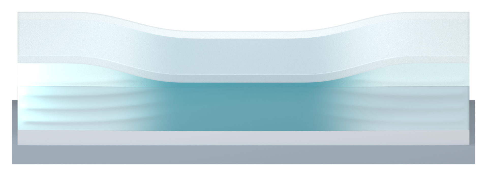

# Continuous central SSG: partial stiffening with a soft transition

The human accepts the V27 pillar interaction close-up and requests a revision of the lower-left central SSG response asset: show a locally harder part and a still-fluid part simultaneously, with a blurred boundary and the same material appearance.

[Transparent PNG](02_SSG_response_contrast_v28_asset.png)

The earlier paired before/after image is replaced with one continuous, gently pressed central section. Its middle has a denser, smoother solid-like appearance; the shoulders retain shallow curved native wave relief. A broad continuous smoothstep attribute blends their opacity, cyan tint and relief amplitude, with no separate solid insert, seam or hard outline. The central region remains pillar-free.

The liquid-like portions retain the exact accepted SSG color and diffuse/transparent shader family: Principled roughness 0.4 and zero transmission. The same pale cyan family becomes denser toward the loaded centre, with opacity smoothly rising from 0.22 to at most 0.90. The intact silicone cover retains its complete nominal 0.5 mm thickness and V27 opacity 0.36. Neutral base/support materials follow V27. No glass, crystals, molecular lattice, arrow or text is added to this asset.

The shallow curves are native section-face relief, fading smoothly into the planar middle and at the silicone contacts. A 0.005 mm display separation follows the existing rendering convention and prevents coplanar surface artifacts. Camera yaw and roll are zero, with a mild 23-degree downward view. The final native render uses 96 Cycles samples, RGB denoising and a 1.6-pixel alpha-only compositor cleanup for the translucent cover.

The manuscript describes rate-dependent shear stiffening and liquid-like/solid-like mechanical response. This illustration expresses that response qualitatively, without claiming a thermodynamic phase conversion, crystallization, or a measured or simulated hardening boundary. Indentation, color weights and wave amplitudes are illustrative. Physical simulation runs: zero.

28 checks pass after reopening the saved model. They verify one connected closed SSG bulk, coexistence and continuous blending of both response cues, native wave relief, complete cover, material family, absence of text/arrows in the new asset and preservation of both other scenes. These are geometry/render checks, not physical validation.

## Other assets preserved exactly

[Accepted pillar PNG](03_pillar_context_v28_asset.png)

[Impact section PNG](01_impact_section_v28_asset.png)

Both retained scenes have identical native geometry, materials, modifiers, camera, lighting and render settings to V27. Their raw PNGs, exported assets and white previews are byte-identical to V27. No overall Figure 3 layout work, Pro inquiry or local Git write was performed. This version is ready for human visual feedback.

The original manuscript hash remains unchanged. The reference PPTX was updated externally before V27; its current hash remains `3f01c45619cd1f33d90b2c075ca8d7a651906a39e498782c2eda2ea8f07b66d7`, unchanged by this revision. Neither source document is edited or uploaded. Only six PNGs and two Markdown documents are published. The editable Blender model and three-PNG archive are local deliveries.

[Previous accepted pillar view](../panel_a_v27/MODEL_REVIEW.md)
