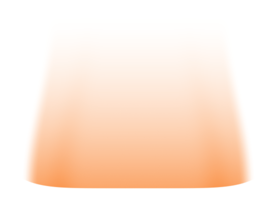

# Shorter streamlined orange impact trail

The human requested gently curved sides with a restrained meteor-like appearance, then a shorter overall trail. Only the independent orange annotation is revised.

The trail height is reduced by 25%, from 16 to 12 mm in its screen plane. Its broad nominal 16 mm lower footprint still matches the central indentation. Both sides curve gently into a 12.8 mm upper tail; the lateral transparency fades over a wider soft edge, and the lower outer corners rise slightly by 0.65 mm. The original orange shader is retained. These dimensions describe an illustration cue, not an impactor measurement.

[Transparent cropped orange PNG](04_orange_impact_trail_v31_asset.png)

## Matching transparent PNG pair

[Whole section](01_impact_section_v31_aligned.png) and [orange trail](04_orange_impact_trail_v31_aligned.png) both have a 2400 x 1100 transparent canvas. Overlay at identical size and origin. The central lower anchor and camera registration are retained. The corner coordinates inherited from V30 are nominal footprint guides; the visible outer corners now curve upward. Cropped assets have different bounds.

This preview checks matching of two independent assets; it is not an overall Figure 3 layout. There are no flames, particles, meteor mass, arrowheads or rendered text.

## Specimen views and SSG filling retained

All three specimen scene snapshots, raw PNGs, cropped assets and white previews are identical to V30. Twenty checks on the saved native V31 model pass, including scene preservation, shader preservation, curved profile, shortened height and pixel registration.

The V30 SSG filling receipt is inherited because the specimen scenes are unchanged. That audit checked 24,136 section/interior points and closed evaluated SSG geometry, finding zero missing or bulk-overlap samples beyond the 0.02 mm display contact tolerance. The source audit and its model SHA256 are recorded locally. No new fill sampling or physical simulation was performed in V31. These are native illustration assets, not computed stress/flow/phase fields.

Only PNGs and Markdown are published. The editable four-scene Blender model and six-PNG archive are local deliveries. No Pro message, local Git write or source-document edit occurred.

[Previous version](../panel_a_v30/MODEL_REVIEW.md)
