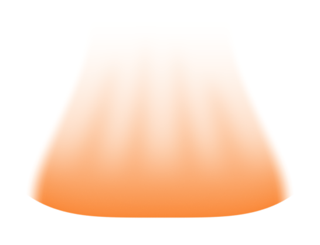

# Stronger downward orange impact cue

The human accepted the short curved shape but requested a clearer downward direction. The lower leading region is now denser and more rounded; the continuous upper tail narrows and fades, with subdued longitudinal motion streaks.

The short 12 mm screen-plane height and nominal 16 mm footprint are retained. The fading upper width is 8.8 mm. The outer lower corners rise 1.4 mm while the central bottom anchor stays registered with the indentation. A denser rounded lower end and a softer trailing upper end convey the intended downward direction. Four subtle native opacity streaks remain joined by the continuous tail. The original orange shader and camera are unchanged. These are qualitative annotation dimensions, not impactor measurements.

[Transparent cropped cue PNG](04_orange_impact_trail_v32_asset.png)

## Exactly registered PNG pair

[Whole section](01_impact_section_v32_aligned.png) and [orange cue](04_orange_impact_trail_v32_aligned.png) are both 2400 x 1100 RGBA. Overlay at identical size and origin. Cropped assets have different bounds. The nominal corner coordinates are footprint guides; the actual outer corners curve upward. This is an alignment preview, not an overall Figure 3 layout.

No text, arrowhead, flames, particles or solid impactor were added. A first internal preview with separated streaks read too much like flames and was replaced by the joined soft body shown here.

## Native preservation and SSG filling

All 22 checks on the reopened native V32 file pass: the three specimen scenes and their raw PNGs match V31, the original orange shader and registration are retained, the short height and broad footprint are retained, and the leading opacity exceeds V31 while the upper tail remains continuous.

The three cropped specimen assets and white previews also match V30 byte for byte. Scene snapshot hashes establish the unchanged chain from V30 through V31 to V32. The V30 fill audit is inherited, not rerun: it checked 24,136 diameter-section/interior points and found no missing or bulk-overlap samples beyond the 0.02 mm near-contact display tolerance. The source audit and native model SHA256 are retained locally.

Native Blender illustration only, not computed flow/stress/phase data. Physical simulation runs: zero. No Pro inquiry, local Git write or source-document edit. Only PNGs and Markdown are published. The four-scene editable Blender file and six-PNG archive remain local deliveries.

[Previous version](../panel_a_v31/MODEL_REVIEW.md)
