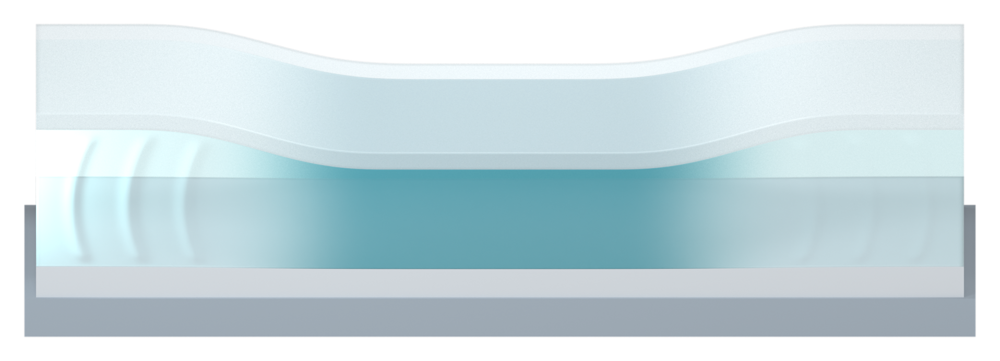

# Full-length gradient on the inverted-trapezoid impact trail

The previous trail remained nearly a solid orange block across its lower two thirds, followed by a short upper fade. The human requested stronger gradation and a review of other impact drawings. V34 replaces only the native opacity field with a continuous nonlinear fade along the full trail.

The human-selected upper-wide/lower-narrow geometry, 12 mm height, 22 mm upper span, 16 mm lower footprint, original orange shader and camera registration are unchanged. The lower contact remains saturated orange; the middle becomes noticeably lighter, and the upper tail disappears smoothly into transparency. The upper sides also fade more softly. There are no flame-like streaks or added arrowheads.

[Transparent cropped PNG](04_orange_impact_trail_v34_asset.png)

## Visual references and design inference

The [D3O official impact visualization](https://www.d3o.com/impact/) uses a white downward loading symbol with a clear leading end and an upward-fading tail. Its physical impactor, arrowhead and surrounding radial arrows are not adopted. The official reference image was inspected locally, and its URL/SHA256 are recorded; its pixels are not republished.

[Adobe's Path Blur guide](https://helpx.adobe.com/photoshop/using/blur-gallery.html#path_blur) describes gradual tapering of a blur trail and directional rather than centered blur. The design inference for this illustration is to extend the fade through the complete trail while preserving the human's inverted trapezoid. This is implemented with native Blender point opacity, not Photoshop raster editing. These references concern appearance only; specimen facts remain grounded in the supplied manuscript.

## Registration and preservation

[Whole section](01_impact_section_v34_aligned.png) and [orange cue](04_orange_impact_trail_v34_aligned.png) are both 2400 x 1100 RGBA. Overlay at identical size and origin. Cropped individual assets have different bounds. This preview verifies matching of separate assets, not overall Figure 3 layout.

All 24 checks on the reopened native V34 model pass. The cue vertex coordinates match V33 byte for byte, the original shader and camera are retained, the upper body remains visibly wider than the lower contact, and middle/upper opacity is substantially lower than V33. The three native specimen scene snapshots and raw PNGs match V33; all specimen PNG exports also match V30 byte for byte.

The V30 SSG filling audit is inherited because the specimen geometry is unchanged: 24,136 section/interior samples, no missing or bulk-overlap samples beyond the 0.02 mm near-contact display tolerance. No fill sampling or physical simulation was rerun.

Qualitative native Blender illustration only, not computed flow/stress/phase fields. No rendered text, impactor mass, external image textures, Pro inquiries, source-document edits or local Git writes. Only original PNG renders and Markdown are published. The editable four-scene model and six-PNG archive are local deliveries.

[Previous version](../panel_a_v33/MODEL_REVIEW.md)
