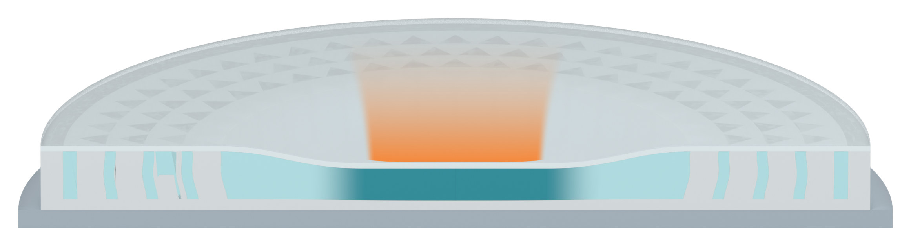
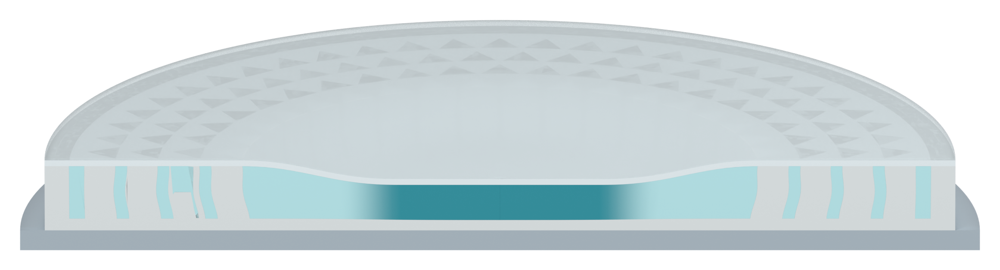

# Gently concave side edges on the orange impact cue

The human requested slightly inward-curving sides on the accepted inverted trapezoid. Only the native cue vertex coordinates change; the full-length orange gradient is retained exactly.

[Transparent cropped PNG](04_orange_impact_trail_v35_asset.png)

Both sides bow inward by 0.55 mm relative to the straight chord between their endpoints at mid-height. The upper/lower widths remain 22/16 mm, and the short height remains 12 mm. The profile remains upper-wide/lower-narrow and monotonic, so the subtle inward curve does not form a neck or arrow tip. These dimensions describe a qualitative visual annotation.

The original orange shader, opacity field, camera, alpha cleanup and central lower anchor are preserved. The saved-model opacity data match V34 byte for byte. All 21 fresh native checks pass, including symmetric inward bow, endpoint widths, height, registration, shader/opacity preservation and preservation of all three specimen scenes.

## Registered transparent pair

[Whole section](01_impact_section_v35_aligned.png) and [orange cue](04_orange_impact_trail_v35_aligned.png) both have a 2400 x 1100 RGBA canvas. Overlay at identical size and origin. Individual cropped assets have different bounds. The combined image is an alignment preview, not an overall Figure 3 layout.

## Specimen views retained

The three native specimen scene snapshots and raw PNGs match V34. All three specimen PNG exports also match V30 byte for byte, so its SSG filling audit remains inherited: 24,136 section/interior samples, zero missing or bulk-overlap samples beyond the 0.02 mm display contact tolerance. No fill sampling or physical simulation was rerun.

Qualitative native Blender illustration only. No rendered text, arrowhead, flame, impactor mass, Pro inquiry, source-document edit or local Git write. Only PNG renders and Markdown are published; the editable four-scene model and six-PNG archive are local deliveries.

[Previous version and visual-reference discussion](../panel_a_v34/MODEL_REVIEW.md)
