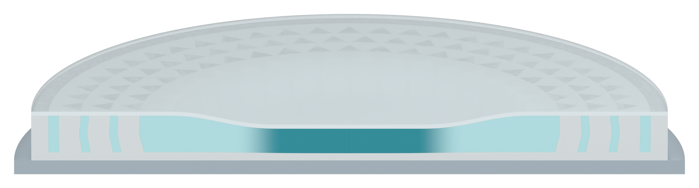

# Three cut pillars on each side; section without impact graphic

The human accepted the three outer cut pillars and requested removal of the innermost two, plus a section without an impact cue. Only the two diameter-cut bodies centered nominally at x=+/-21.2 mm, y=0 are removed from the unified array and its SSG cavity operand. The live Boolean therefore restores gel in both vacated regions.

[Transparent cropped section](01_section_without_impact_v37_asset.png) · [Full 2400 x 1100 RGBA canvas](01_section_without_impact_v37_full_canvas.png)

There are three retained cut pillars on each side, at the original nominal radii 24.8, 28.4 and 32 mm. The other 96 pillar bodies retain all source geometry and deformation-key coordinates exactly. Camera, materials, silicone skins, support, lighting and compression/bow controls are unchanged. The accepted two closeup scenes and the separate orange cue remain byte-preserved in their native data and existing PNGs. The image shown here is rendered from the main scene directly, without an impact overlay.

All 21 fresh native checks pass. Filling was freshly sampled at 24,136 section/interior points: zero missing or bulk-overlap samples beyond the unchanged 0.02 mm display contact tolerance. This is a display tessellation/contact tolerance, not a fabrication specification. The pillar and SSG evaluated meshes are closed, with no zero-area faces.

Native Blender qualitative illustration only; no physical solver or thermodynamic phase calculation. No new Pro message, source-document edit, overall figure layout or local Git write. This revision publishes only the requested section PNGs and Markdown. Native models and local verification receipts are not uploaded.

[Previous version](../panel_a_v36/MODEL_REVIEW.md)
