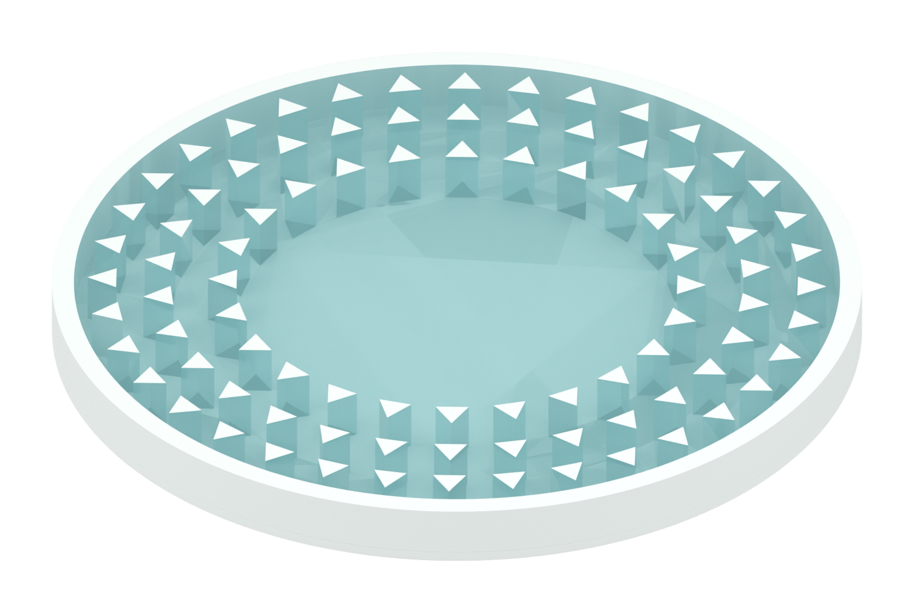
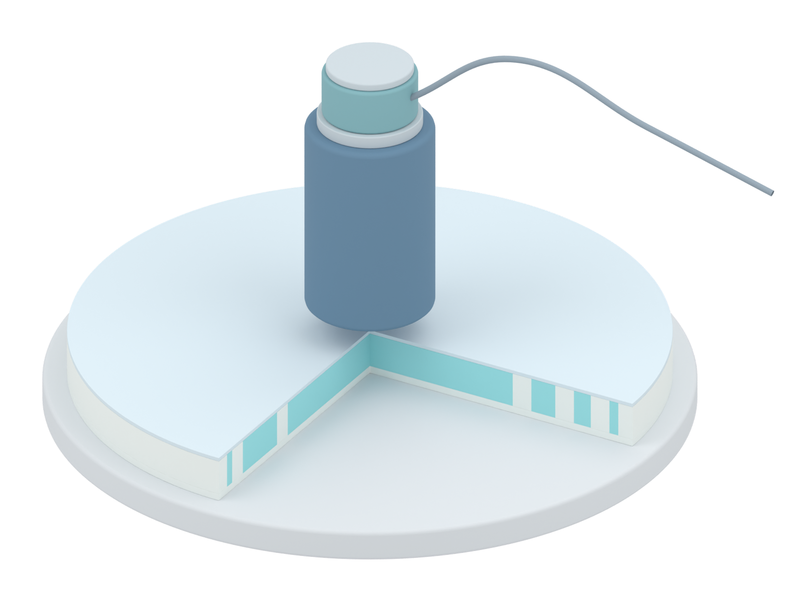
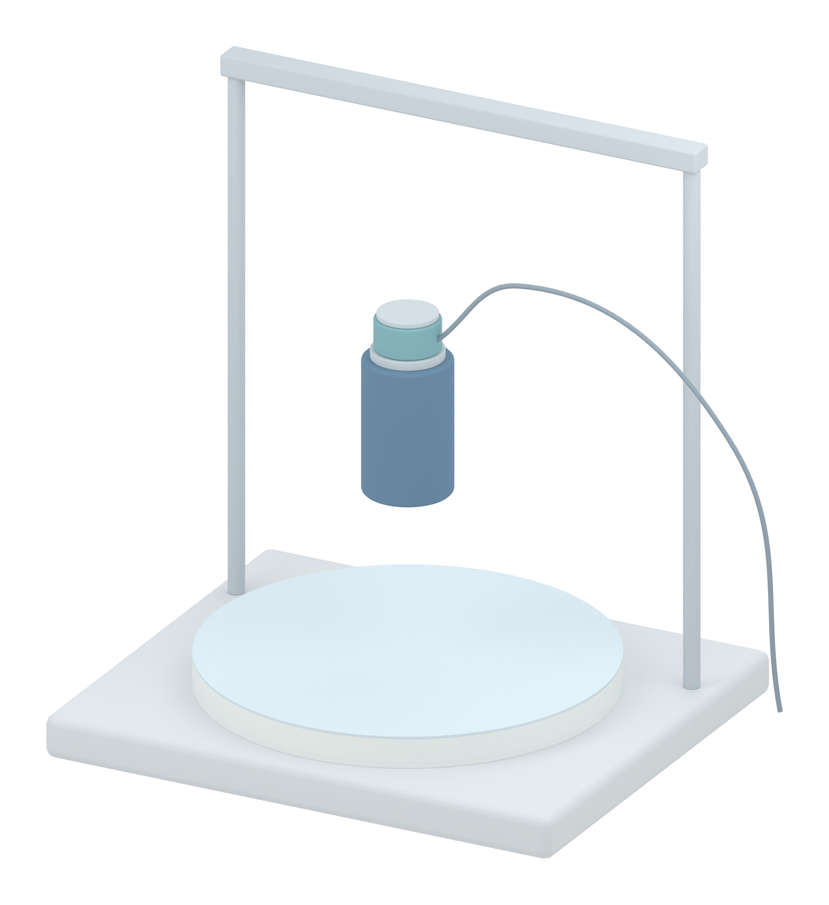

# AM Figure 3 独立建模首版

本轮交付三张独立的模型审查视图。圆盘形态参照用户提供的 Figure 1，Figure 3 冲击试样按论文原文不含电路。当前阶段不处理整个 Figure 3 的排布，不提供新实验数据或 FEA 结果。

## 图稿

### 揭盖形态视图

圆形外框、中央留空区和外围三角形截面样式的突起来自 Figure 1 的视觉识别。此图省略盖层的渲染以展示微结构，实际盖层几何仍保留在 Blender 文件中。SSG 用浅青色作区分，颜色不是实测颜色或应力云图。没有 LED、蛇形互连或电极。

### 冲击剖面视图

四分之一剖切用于显示层次。蓝灰色柱体为示意冲击头，上方青灰色小部件为后侧力传感器，信号线从该部件引出。试样下方为承托平台。

### 装置视图

试样保留封盖，展示冲击头、后侧传感器和简化支架的相对关系。支架、冲击头和传感器的外形与尺寸为示意。未把整机高度画作真实的 10、20 或 30 cm 标距。

## 科学口径核对与 Pro 方案纠正

论文 §2.3 明确写无电子器件的 circular encapsulation specimens；Drop-Weight Impact Measurements 也写 specimens without embedded circuits。因此 Figure 1 只提供封装形态依据，不把其内部电路移入 Figure 3。

原稿 §2.3 和方法部分都将力传感器置于冲击头后侧。方法中的直接表述为：

> A force sensor at the rear side of the impactor recorded the force as a function of time.

用户已规定冲突时以论文原文为准。因此之前 Pro 的“试样下方传感器 / 底部 transmitted force”方案在本任务中予以纠正。本图后续标注采用 rear-mounted force sensor、recorded impact force F(t) 与 peak force F_peak；下方结构为 rigid support，不标为 force sensor。峰值力不是能量积分。

Figure 3 包含真实落锤实验和相应仿真两类内容。用户 PPT 第 3 页的 c-e 是测量力曲线，f-h 是仿真变形与应力。本轮只为 a,b 准备图稿，不替代实验或计算结果。

## 来源给定与作图假设

| 项目 | 来源和边界 |
|---|---|
| 外径 74 mm、总厚度 6 mm | 论文 §2.3 和方法给定，本地模型尺寸已独立检查 |
| 盖层 0.5 mm、中间区域 4.5 mm、基底 1 mm | 液体与 hybrid 的层厚；不能自动套用于 uniform solid 对照 |
| 370 g、10/20/30 cm | 原文给定的冲击输入；本阶段不做图面参数排版 |
| 圆形外框、中央区域、外围突起 | 参照 PPT Figure 1；三角形截面样式来自图片识别 |
| 微柱数量、间距、具体高度和朝向 | 没有真实 CAD 尺寸，本模型用于形态示意，不声称一比一复现 |
| 冲击头、力传感器、支架外形 | 原文没有精确尺寸，作图占位 |
| 透明度与颜色 | 科学图的显示选择，不是材料光学参数 |
| 物理仿真或数据生成 | 0 次；这些文件只包含 Blender 建模与渲染 |

## 文件与核验

所有 PNG 已逐张打开检查，原 DOCX/PPTX/参考图 SHA256 前后不变。Blender 内的外径、层厚、总高度、后侧传感器相对位置与正交相机设置已重新读取检查。

只向仓库发布本轮三个白底 PNG 和这份来源审查说明。BLEND、原始 DOCX/PPTX、视频、压缩包及调试结果均保留本地。透明底 PNG、本地 Blender 源文件和生成脚本在独立目录留存。

本轮尚未进行整张 Figure 3 的排版、最终英文标注、尺寸箭头、F(t) 示意曲线或 PPT 替换。这些属于后续图稿工作。

### 来源文件哈希

- Zhanyu_manuscript_AM(1).docx: SHA256 333739523d31456a5af716dcae5dbbddb1ffb54254c982b6a6f4757500260da4
- FigureSet - V2.3.pptx: SHA256 6de1a257b1ac2161eeb215a3e5794ea56fc4df772d8aecdd124f59b95a3f1b83
- codex-clipboard-0c5a73d8-38e6-4c94-a233-613608899ce3.png: SHA256 8951b1452a9ebfc65ac4e7e934e70dd90ae1b65a794b918dacba86754ffc0afa

本地 AM_Fig3_models_v04.blend: SHA256 15e9b37dd5a50869a247ccac693404fb0cd62bda70ed7f9a8b319c500eec6ad6

### 已发布 PNG 哈希

- Specimen_morphology_white.png: 1518 × 1019 px; SHA256 cd4f5868df86bbafd819092a4e8016f5da3530a7c538cd0613de34fc949f8721
- Impact_section_white.png: 1653 × 1227 px; SHA256 c64a1f18e8d3074ad199bc9d120abaeec3ee4083f85916dd1be63263c78b64ec
- Impact_setup_white.png: 1542 × 1683 px; SHA256 3812df42df4b45424da144be3574180ee53abc15ffc960fbf343d0a71f0b02dd
